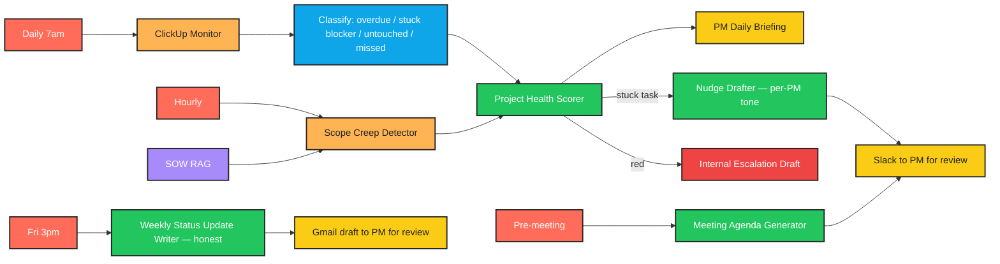

# CLAUDE.md — Internal Project Manager Assistant

> **Language:** Python (3.10+)
> **Client:** Mei L., COO — Forge Creative Agency
> **Budget:** $3,500–6,000 | **Timeline:** 3 weeks

---

## 1. Project Overview

Forge runs **18 active client projects at any time** across web design, branding, and content. Their **two project managers** spend most of their time on the same repetitive things:

- Chasing overdue tasks
- Drafting status updates for clients
- Flagging blockers to leadership
- Updating timelines when scope changes

We are building an **AI PM assistant** that handles all of that so the PMs spend their time on **actual project leadership instead of admin**.

---

## 2. Required Features

| # | Feature | Notes |
|---|---------|-------|
| 1 | Monitors ClickUp daily for overdue tasks, stuck blockers, missed deadlines | Daily 7am scan |
| 2 | Drafts personalized nudge messages to assignees via Slack | Reviewed by PM |
| 3 | Every Friday: drafts weekly status update for each client | Based on project activity |
| 4 | Detects scope creep | Flags when tasks added that weren't in original SOW |
| 5 | Daily morning briefing to PMs | What's at risk, what's stuck, who needs help |
| 6 | Drafts internal escalation message to leadership | When project goes red |
| 7 | Auto-generates meeting agendas | For weekly client check-ins from recent activity |

---

## 3. Important Constraints

- **Never send anything externally without PM approval.** All client-facing communication is a draft.
- **Internal Slack nudges must match each PM's tone.** Each PM has their own voice — agent must mimic it.
- **Status updates must be honest** — flag problems clearly, never sugarcoat. Yellow/red is yellow/red.
- **Scope creep flags must show evidence** — original SOW vs current task list, with diffs.
- **Must distinguish between "stuck blocker" and "task just hasn't been touched yet."** These need different actions.

---

## 4. Tech Stack

```
Python 3.10+    |   ClickUp API          |   Slack API
Claude API      |   RAG over SOWs and contracts (Pinecone)
Gmail API       |   APScheduler          |
```

---

## 5. Architecture

```
   ┌─────────────────────────────────────────────────────────┐
   │            SCHEDULER (APScheduler)                       │
   │   Daily 7am   → ClickUp scan + PM briefing               │
   │   Daily 9am   → Slack nudge drafts to PMs for review     │
   │   Friday 3pm  → Weekly client status drafts              │
   │   Hourly      → Scope creep + red-project check          │
   └─────────────────────────────────────────────────────────┘
                            │
                            ▼
   ┌─────────────────────────────────────────────────────────┐
   │            CLICKUP MONITOR                               │
   │  - Fetch all tasks across 18 active projects             │
   │  - Compute per task:                                     │
   │      - overdue? (due date < today)                       │
   │      - stuck blocker? (no activity in 5d AND status=     │
   │        "in progress" AND has dependencies)               │
   │      - untouched? (no activity in 5d AND status=         │
   │        "to do" AND no dependencies)                      │
   │      - missed deadline? (closed past due date)            │
   └─────────────────────────────────────────────────────────┘
                            │
                            ▼
   ┌─────────────────────────────────────────────────────────┐
   │            SCOPE CREEP DETECTOR                          │
   │  - RAG retrieves original SOW for each project           │
   │  - Compare current task list against SOW                 │
   │  - Flag tasks not derivable from SOW + show evidence:    │
   │    "Task 'Add CMS migration' has no parallel in SOW      │
   │     section 'Deliverables' — see SOW p.3"                │
   └─────────────────────────────────────────────────────────┘
                            │
                            ▼
   ┌─────────────────────────────────────────────────────────┐
   │            PROJECT HEALTH SCORER (Claude)                │
   │  - For each project: green / yellow / red                │
   │  - Reasoning explicit, with which signals drove the      │
   │    color (count of overdue, blockers, scope additions)   │
   └─────────────────────────────────────────────────────────┘
                            │
        ┌───────────────────┼─────────────────────────────┐
        ▼                   ▼                             ▼
   ┌──────────────┐  ┌──────────────────┐  ┌──────────────────────┐
   │ PM BRIEFING  │  │ NUDGE DRAFTER    │  │ STATUS UPDATE WRITER  │
   │ (daily 7am)  │  │ (per stuck task) │  │ (Fri 3pm, per client) │
   │ - At-risk    │  │ - Per-PM tone    │  │ - Honest yellow/red   │
   │ - Stuck      │  │ - Distinguishes  │  │ - Drafts Gmail        │
   │ - Who needs  │  │   stuck vs       │  │   for PM review       │
   │   help       │  │   untouched      │  │                       │
   └──────────────┘  └──────────────────┘  └──────────────────────┘
        │                   │                             │
        └─────────┬─────────┘                             │
                  ▼                                       │
   ┌──────────────────────────────┐                       │
   │  Slack → PM (review queue)   │                       │
   └──────────────────────────────┘                       │
                                                          │
                                                          ▼
                                            ┌──────────────────────┐
                                            │  Gmail draft → PM    │
                                            │  for client review   │
                                            └──────────────────────┘

   ┌─────────────────────────────────────────────────────────┐
   │            RED-PROJECT ESCALATION                        │
   │  - Project flips to red → draft internal escalation      │
   │    message to leadership Slack channel (PM approves)     │
   └─────────────────────────────────────────────────────────┘

   ┌─────────────────────────────────────────────────────────┐
   │            MEETING AGENDA GENERATOR                      │
   │  - Day before weekly client check-in:                    │
   │    pull recent activity + open items + decisions needed  │
   │    → draft agenda → PM review                            │
   └─────────────────────────────────────────────────────────┘
```

---

## 6. Development Workflow

```
┌──────────────────────────────────────────────────────────────┐
│                  DEVELOPMENT WORKFLOW                        │
└──────────────────────────────────────────────────────────────┘

  STEP 1 — PLAN
    • Read this CLAUDE.md fully before writing code
    • Pick ONE module to build first (suggest: ClickUp monitor
      + stuck-vs-untouched classifier — everything else depends
      on it)
    • Get the 18 active project SOWs from Mei BEFORE building
      the scope creep detector

  STEP 2 — IMPLEMENT (Python)
    • All secrets via environment variables (.env + dotenv)
    • Pydantic schemas for project health, nudges, status updates
    • PM tone profiles stored per-PM (RAG over their past Slack
      messages or status updates)
    • Log every scan with project_id, task counts per category
    • Wrap every API call in try/except with specific exceptions

  STEP 3 — RUN THE SCRIPT
    • Test against a ClickUp sandbox or 1-2 real projects first
    • Verify: stuck blockers are correctly distinguished from
      untouched tasks
    • Verify: scope creep flags include SOW evidence with section
      references
    • Verify: NO external Slack/email sent — only drafts to PMs
    • Verify: each PM's nudge drafts match their tone

  STEP 4 — IF YOU HIT AN ERROR ────────────────────────────────
    │
    │  4a. READ THE FULL ERROR MESSAGE AND TRACEBACK
    │      ─ Do NOT skip lines
    │      ─ Read every line of the traceback, top to bottom
    │      ─ Identify:
    │           • Exact file and line number
    │           • Exception type
    │           • The actual value that caused the failure
    │      ─ For ClickUp errors: log endpoint + project_id +
    │        response JSON
    │      ─ For Claude errors: log the full prompt and raw
    │        response
    │      ─ For scope-creep false positives: log the task, the
    │        SOW section retrieved, and the similarity score
    │
    │  4b. FIX THE SCRIPT
    │      ─ Find the root cause — do NOT guess
    │      ─ Re-read the function being edited end to end
    │      ─ Make the smallest possible targeted fix
    │      ─ Critical: if a fix could cause an external send,
    │        treat as P0
    │      ─ Critical: if a fix relaxes the "stuck vs untouched"
    │        distinction, add a regression test using a real
    │        ambiguous task from the project
    │      ─ Critical: if a fix would let status updates
    │        sugarcoat red projects, do NOT — honesty is the
    │        constraint
    │
    │  4c. RETEST
    │      ─ Re-run the full pipeline, not just the failing step
    │      ─ Confirm the original error is gone
    │      ─ Run edge cases:
    │           • Task in progress 5 days, has dependencies
    │             (must classify as "stuck blocker", not
    │             "untouched")
    │           • Task to do 5 days, no dependencies
    │             (must classify as "untouched")
    │           • New task added matching a SOW deliverable
    │             phrased differently (must NOT flag as scope)
    │           • Genuinely new task with no SOW basis (must
    │             flag with evidence)
    │           • Project flips red mid-day (escalation draft
    │             fires within the hour)
    │      ─ Verify NO external send — only drafts
    │
    │  4d. DOCUMENT WHAT YOU LEARNED
    │      ─ Append an entry to the "## Error Log" section below
    │      ─ Use the template provided
    │      ─ Mark [SAFETY] / [CLASSIFICATION] / [SCOPE] / [TONE]
    │
    └─────────────────────────────────────────────────────────

  STEP 5 — VALIDATE OUTPUT
    • Stuck vs untouched correctly distinguished
    • Scope creep flags include SOW evidence
    • Status updates flag yellow/red honestly
    • Nudge drafts match per-PM tone
    • All client comms are drafts only
    • Red-project escalation fires when health flips

  STEP 6 — GENERATE README.md
    • See section "## 8. README.md Requirements" below
```

---

## 7. Error Log

### Entry Template

```
### [YYYY-MM-DD] — [short title]

**Error Type:**

**Full Error Message:**
\```
Last 5–10 lines of traceback verbatim.
\```

**What I Was Doing:**

**Root Cause:**

**Fix Applied:**

**Lesson Learned:**
Mark [SAFETY] / [CLASSIFICATION] / [SCOPE] / [TONE].
```

---

## 8. README.md Requirements

After the project is functional, generate a `README.md` file in the project root. The README must include an **n8n-style workflow / architecture graphic** so Mei and the PMs can see every job the agent runs.

### Required README sections

1. **Project title + 1-line tagline**
2. **What it does** (3–5 sentences, non-technical)
3. **Workflow diagram** — render as an **n8n-style node graph** using Mermaid `flowchart LR`. Color-code by node type: trigger, monitor, RAG, AI, classify, review, escalate.
4. **Stuck vs untouched** — explicit definition with rule logic
5. **Scope creep methodology** — how SOW comparison works
6. **PM tone profiles** — how each PM's voice is captured
7. **Tech stack table**
8. **Folder structure**
9. **Setup instructions** — clone, venv, install, ClickUp + Slack OAuth, env vars
10. **Environment variables** — table of every var
11. **Configuration** — projects, PMs, tone profile sources, schedule times
12. **Running locally** — single command for each job (briefing, nudges, status, agenda)
13. **Scheduling** — APScheduler job table
14. **Troubleshooting** — common errors and fixes (sourced from the Error Log)

### Mermaid template



---

## 9. Python Project Conventions

- **Folder structure:**
  ```
  /src
    /monitor         # ClickUp fetcher + task classifier
    /scope           # SOW RAG + comparison
    /health          # project health scorer
    /drafters
      nudge.py       # per-PM tone
      status.py      # weekly status, honest
      escalation.py  # internal red-project escalation
      agenda.py      # meeting agendas
    /briefing        # daily PM briefing
    /tone            # per-PM voice profiles
    /scheduler
  /tests
    /fixtures
      sows/          # sample SOWs
      tasks/         # sample task snapshots
  .env.example
  requirements.txt
  README.md
  CLAUDE.md
  ```
- **Classification rules (codified, not inferred):**
  - `stuck_blocker`: status="in progress" AND no_activity_days >= 5 AND has_dependencies
  - `untouched`: status="to do" AND no_activity_days >= 5 AND not has_dependencies
  - `overdue`: due_date < today AND not closed
  - `missed_deadline`: closed AND closed_at > due_date
- **Tone profiles:** Each PM has a Pinecone namespace of their past Slack nudges. Drafter retrieves top-3 for style examples per task type.
- **Scope creep evidence:** Every flagged task must cite the SOW section retrieved + similarity score below threshold
- **Status update honesty rule:** If `health == red`, status update prompt forbids softening adjectives. A validator scans for soft-pedalling words (e.g. "minor", "slight", "smooth") in red sections and rejects.
- **Type hints:** Required
- **Tests:** `pytest`. Required tests:
  - "stuck blocker vs untouched correctly classified"
  - "scope flag requires SOW evidence"
  - "red status update cannot contain soft-pedal words"
  - "PM tone profile influences nudge phrasing"
