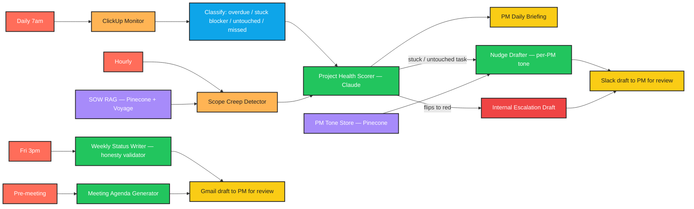

# Forge PM Assistant

> An AI project manager assistant that handles the repetitive admin so Forge's PMs can spend their time on actual project leadership.

---

## What it does

Forge Creative Agency runs 18 active client projects across web design, branding, and content. Two project managers spend most of their day chasing overdue tasks, drafting status updates, flagging blockers, and updating timelines. This service scans ClickUp every morning, classifies what's stuck vs. untouched, compares the current task list against the original SOW to catch scope creep, scores each project red/yellow/green with explicit reasoning, and drafts every internal nudge, weekly client status, escalation, and meeting agenda for the PM to review. **Nothing is ever sent externally without PM approval** — every output is a draft routed to the PM's review queue.

---

## Workflow diagram



---

## Stuck vs untouched

The single most important classification in the system, because **a stuck blocker and an untouched task need different actions** — and the wrong nudge to the wrong person damages trust.

Codified in [`src/monitor/classifier.py`](src/monitor/classifier.py):

| Flag | Status | No activity for | Dependencies | What it means |
|------|--------|-----------------|--------------|---------------|
| `stuck_blocker` | `in progress` | ≥ 5 days | has upstream deps | Someone is blocked. Ask about the dependency, not their effort. |
| `untouched` | `to do` | ≥ 5 days | none | Task is being ignored. Ask if the assignee has the context to start. |
| `overdue` | not closed | n/a | n/a | Due date is in the past. |
| `missed_deadline` | closed | n/a | n/a | Closed after the due date. |

Flags are independent — a task can be both `stuck_blocker` and `overdue`. Rule thresholds (5 days, etc.) are configurable via `STUCK_BLOCKER_DAYS` and `UNTOUCHED_DAYS` env vars.

---

## Scope creep methodology

Each project's Statement of Work is ingested into Pinecone (one namespace per project) by [`src/scope/sow_ingest.py`](src/scope/sow_ingest.py). Each SOW chunk carries section + page metadata.

When the hourly scope-creep job runs, [`src/scope/scope_detector.py`](src/scope/scope_detector.py):

1. Embeds the task name with Voyage AI (`voyage-3-lite`, 512-dim).
2. Queries the project's Pinecone namespace, top-K = 3.
3. Takes the highest cosine similarity score across the returned chunks.
4. If `best_similarity < SCOPE_SIMILARITY_THRESHOLD` (default `0.72`) → flags the task as scope creep.
5. Always attaches the closest-match chunk as evidence, so the PM can verify the call.

Example evidence line:
> Task 'Add native iOS app' has no parallel in SOW section 'Out Of Scope', p.3 (closest match similarity=0.45 < threshold 0.72).

This means **every scope-creep flag comes with a citation** — section name, page number, and similarity score. No black-box rejection.

---

## PM tone profiles

Each PM has a Pinecone namespace (e.g. `tone-pm-alex`) holding their past Slack nudges and status updates. The drafter [`src/drafters/nudge.py`](src/drafters/nudge.py):

1. Resolves the PM owning the project via [`config/pms.json`](config/pms.json).
2. Embeds a query describing the nudge intent.
3. Retrieves the top-3 most semantically similar past nudges from that PM's namespace.
4. Passes them to Claude as tone examples in the system prompt, instructing the model to imitate sentence length, openers, sign-offs, formality, and emoji usage.

Result: two different PMs sending nudges about identical tasks produce measurably different drafts. Pinned by [`tests/test_nudge_drafter.py::test_pm_tone_profile_influences_nudge_phrasing`](tests/test_nudge_drafter.py).

To seed a PM's tone namespace, run a one-off ingestion of their past Slack history (out of scope for the agent; do this once when onboarding a PM).

---

## Honesty constraint

Weekly client status emails are the highest-risk surface in this system: an AI can easily soften red projects into yellow, and a sugar-coated update is worse than no update at all.

Two layers of defense:

1. **Prompt-level (red projects only):** the system prompt explicitly forbids softening words (`minor`, `slight`, `smooth`, `tiny`, `modest`, `trivial`, `negligible`, `minimal`, etc.) and phrases (`nothing major`, `no big deal`).
2. **Post-hoc validator** at [`src/drafters/honesty.py`](src/drafters/honesty.py): scans the generated body. If forbidden words are found, the writer retries with the offender list injected into the prompt. If the second attempt still violates, [`SoftPedalError`](src/drafters/honesty.py) is raised — the system **refuses to send a soft-pedalled red update**. Pinned by [`tests/test_status_writer.py::test_red_status_update_cannot_contain_soft_pedal_words`](tests/test_status_writer.py).

---

## Tech stack

| Layer | Tool |
|---|---|
| Language | Python 3.10+ |
| Schemas | Pydantic v2 |
| ClickUp client | `requests` against ClickUp v2 REST API |
| LLM | Anthropic Claude (model: `claude-opus-4-7`) |
| Embeddings | Voyage AI (`voyage-3-lite`, 512-dim) |
| Vector store | Pinecone (serverless, one namespace per project/PM) |
| Slack | `slack-sdk` (chat.postMessage) |
| Gmail drafts | `google-api-python-client` (drafts.create — never send) |
| Scheduler | APScheduler (CronTrigger + IntervalTrigger) |
| Document parsing | `pypdf` |
| Tests | `pytest`, `pytest-mock`, `freezegun` |

---

## Folder structure

```
src/
  monitor/            # ClickUp fetcher + stuck/untouched/overdue classifier
    clickup_client.py
    classifier.py
    models.py
    monitor.py
  scope/              # SOW RAG + scope-creep detector
    sow_ingest.py
    sow_store.py
    embeddings.py
    scope_detector.py
    models.py
  health/             # Project health scorer + state tracking
    signals.py
    scorer.py
    state.py
    models.py
  drafters/           # Every PM-facing draft
    nudge.py
    status.py
    escalation.py
    agenda.py
    honesty.py        # Soft-pedal validator
    models.py
  briefing/           # Deterministic daily PM briefing
    briefing.py
  tone/               # PM voice profiles
    registry.py
    tone_store.py
    models.py
  scheduler/          # APScheduler wiring + job functions + sinks
    runner.py
    jobs.py
    sinks.py
  config.py           # Env settings (frozen dataclass)
  cli.py              # python -m src.cli {briefing,nudges,status,...}
tests/
  fixtures/
    sows/             # Sample SOW for ingestion tests
    tasks/            # Sample ClickUp task payloads
    config/           # Sample pms.json
  test_*.py
config/
  pms.json            # PM ↔ project mapping (edit this when onboarding/offboarding)
.env.example
requirements.txt
pyproject.toml
README.md
CLAUDE.md
```

---

## Setup instructions

```bash
# 1. Clone + create a virtual environment
git clone <repo-url> forge-pm-assistant
cd forge-pm-assistant
python -m venv .venv
.venv\Scripts\activate          # PowerShell on Windows
# source .venv/bin/activate       # bash/zsh on macOS/Linux

# 2. Install dependencies
pip install -r requirements.txt

# 3. Configure environment
cp .env.example .env
# Edit .env and fill in:
#   CLICKUP_API_TOKEN   from clickup.com → Settings → Apps
#   CLICKUP_TEAM_ID     from your ClickUp URL: app.clickup.com/<TEAM_ID>/...
#   ANTHROPIC_API_KEY   from console.anthropic.com
#   PINECONE_API_KEY    from app.pinecone.io
#   VOYAGE_API_KEY      from dash.voyageai.com
#   SLACK_BOT_TOKEN     from api.slack.com (scopes: chat:write, channels:read, users:read)
#   GMAIL_CREDENTIALS_PATH  path to OAuth client JSON (see Gmail setup below)

# 4. Map PMs to projects
# Edit config/pms.json: replace REPLACE_WITH_CLICKUP_SPACE_ID_* with real Space IDs
# from your ClickUp workspace.

# 5. Run the test suite to confirm the environment is wired
pytest

# 6. (Optional) Ingest SOWs into Pinecone
python -m src.cli ingest-sow --project <CLICKUP_SPACE_ID> --path ./sows/acme.pdf

# 7. (Optional) Start the scheduler (long-running)
python -m src.cli scheduler
```

### Gmail OAuth setup

1. In [Google Cloud Console](https://console.cloud.google.com/), create a project and enable the Gmail API.
2. Create OAuth 2.0 credentials → Desktop app.
3. Download the JSON to `./.secrets/gmail_credentials.json`.
4. First run of any job that emits a status/agenda will open a browser for consent; the resulting token is cached at `./.secrets/gmail_token.json`.
5. Required scope: `https://www.googleapis.com/auth/gmail.compose` (drafts only — the bot **cannot** send).

---

## Environment variables

| Variable | Required | Default | Purpose |
|---|---|---|---|
| `CLICKUP_API_TOKEN` | yes | — | ClickUp personal API token |
| `CLICKUP_TEAM_ID` | yes | — | ClickUp workspace ID |
| `ANTHROPIC_API_KEY` | yes | — | Claude API key |
| `ANTHROPIC_MODEL` | no | `claude-opus-4-7` | Claude model id |
| `PINECONE_API_KEY` | yes | — | Pinecone API key (SOWs + tone) |
| `PINECONE_INDEX` | no | `forge-sows` | Index name for SOW chunks |
| `PINECONE_CLOUD` | no | `aws` | Pinecone serverless cloud |
| `PINECONE_REGION` | no | `us-east-1` | Pinecone serverless region |
| `VOYAGE_API_KEY` | yes | — | Voyage embeddings API key |
| `VOYAGE_MODEL` | no | `voyage-3-lite` | Embedding model (512-dim) |
| `SLACK_BOT_TOKEN` | yes (live) | — | `xoxb-...` bot token |
| `SLACK_LEADERSHIP_CHANNEL` | no | `#leadership` | Where escalations are routed after PM approval |
| `SLACK_PM_REVIEW_CHANNEL` | no | `#pm-review` | Where drafts are posted for PM review |
| `GMAIL_CREDENTIALS_PATH` | yes (live) | `./.secrets/gmail_credentials.json` | OAuth client JSON path |
| `GMAIL_TOKEN_PATH` | no | `./.secrets/gmail_token.json` | Cached OAuth token path |
| `STUCK_BLOCKER_DAYS` | no | `5` | Inactivity days for stuck-blocker classification |
| `UNTOUCHED_DAYS` | no | `5` | Inactivity days for untouched classification |
| `SCOPE_SIMILARITY_THRESHOLD` | no | `0.72` | Below this → flagged as scope creep |
| `SCOPE_RAG_TOP_K` | no | `3` | Pinecone top-K for scope retrieval |
| `TZ` | no | `America/Los_Angeles` | Scheduler timezone |
| `DRY_RUN` | no | `true` | When true, only the filesystem sink is active |

---

## Configuration

- **PM ↔ project mapping:** [`config/pms.json`](config/pms.json). One entry per PM with their Slack ID, email, Pinecone tone namespace, and the list of ClickUp Space IDs they own. A `default_pm_id` catches projects without an explicit owner.
- **Tone profile sources:** Pinecone namespaces named `tone-pm-<id>`. Seed once per PM with their past Slack nudges (~50 examples is a reasonable starting size).
- **Schedule times:** hard-coded in [`src/scheduler/runner.py`](src/scheduler/runner.py) — change them there and restart the scheduler.

---

## Running locally

Each job has a single command. All run against your `.env` config and write outputs to `./drafts/<YYYY-MM-DD>/`.

```bash
python -m src.cli briefing                                # 7am morning briefing
python -m src.cli nudges                                  # 9am nudge drafts
python -m src.cli status                                  # Fri 3pm status drafts
python -m src.cli hourly                                  # Hourly red-transition check
python -m src.cli agenda --project P-acme --date 2026-05-22   # On-demand meeting agenda
python -m src.cli ingest-sow --project P-acme --path ./sows/acme.pdf
python -m src.cli scheduler                               # Long-running: all jobs on cron
```

In `DRY_RUN=true` (the default) every draft lands as JSON under `./drafts/<date>/<type>/<id>.json`. Inspect, copy what you need, send manually. In `DRY_RUN=false` with valid Slack + Gmail credentials, drafts also flow to the PM review channel and Gmail drafts queue.

---

## Scheduling

| Job | Trigger | Function |
|---|---|---|
| Daily scan + PM briefing | Cron `0 7 * * *` | `jobs.run_daily_scan_and_briefing` |
| Slack nudge drafts | Cron `0 9 * * *` | `jobs.run_morning_nudges` |
| Weekly client status drafts | Cron `0 15 * * 5` (Friday 3pm) | `jobs.run_weekly_status_drafts` |
| Red-transition check + escalations | Interval `every 1h` | `jobs.run_hourly_red_check` |

The hourly check uses [`src/health/state.py`](src/health/state.py) to detect non-red → red transitions; it only emits an escalation draft on the **first** scan that finds a project red, not every hour while it stays red.

---

## Troubleshooting

| Symptom | Cause | Fix |
|---|---|---|
| `ClickUpError: 401` | Token expired or wrong header format | Personal tokens go in the raw `Authorization` header — no `Bearer ` prefix. Regenerate at ClickUp → Apps. |
| `SoftPedalError` raised during status job | Claude kept using forbidden words after the retry | The validator did its job — the project is red and the draft was rejected. Open the job log to see the offender list, then hand-write the status for that one project. |
| `PMRegistryError: No PM assigned to project X` | A new ClickUp Space appeared and isn't in `config/pms.json` | Add the Space ID to a PM's `projects` array, or rely on `default_pm_id`. |
| All scope-creep flags fire on every task | No SOW indexed for that project | Run `python -m src.cli ingest-sow --project <id> --path <pdf>`. The detector won't flag when no SOW is present (returns `is_scope_creep=False` with a "cannot evaluate" evidence line). |
| Escalation fires every hour for the same red project | State file got deleted or corrupted | Check `./state/health_state.json`. If missing/corrupt, the detector treats the next scan as "first seen", which counts as a transition. One re-alert is the worst case. |
| Pinecone index dimension mismatch | Switched embedding models without resetting | Voyage `voyage-3-lite` is 512-dim. If you change `VOYAGE_MODEL`, delete the index and reindex. |
| Tests pass but live scheduler hangs at startup | `SLACK_BOT_TOKEN` set but the bot isn't in the channel | Invite the bot to `SLACK_PM_REVIEW_CHANNEL` and `SLACK_LEADERSHIP_CHANNEL`. |
| Gmail draft step blocks waiting for a browser | First-run OAuth consent | Run any status/agenda command interactively once; the token caches to `GMAIL_TOKEN_PATH`. After that, headless is fine. |

Operational issues encountered during development get appended to the Error Log in [`CLAUDE.md`](CLAUDE.md) — check there for recent fixes.

---

## Test suite

135 tests across 16 files covering every required scenario from CLAUDE.md:

```bash
pytest                          # full suite, no API keys needed
pytest -v                       # verbose
pytest tests/test_status_writer.py::test_red_status_update_cannot_contain_soft_pedal_words
```

The four required tests from CLAUDE.md §9:

| Required test | Location |
|---|---|
| stuck blocker vs untouched correctly classified | [`tests/test_classifier.py::test_stuck_vs_untouched_correctly_classified`](tests/test_classifier.py) |
| scope flag requires SOW evidence | [`tests/test_scope_detector.py::test_scope_flag_requires_sow_evidence`](tests/test_scope_detector.py) |
| red status update cannot contain soft-pedal words | [`tests/test_status_writer.py::test_red_status_update_cannot_contain_soft_pedal_words`](tests/test_status_writer.py) |
| PM tone profile influences nudge phrasing | [`tests/test_nudge_drafter.py::test_pm_tone_profile_influences_nudge_phrasing`](tests/test_nudge_drafter.py) |

All four are pinned. Run them anytime to confirm the safety constraints still hold.
